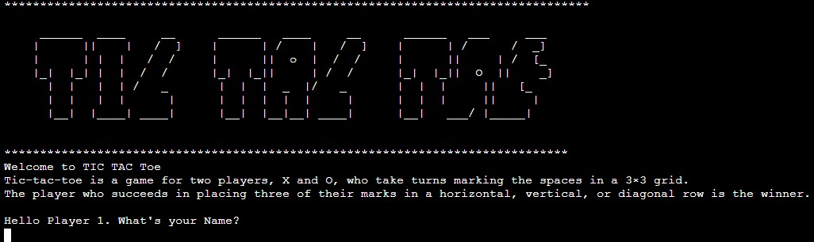
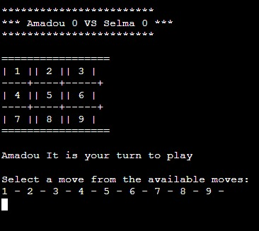
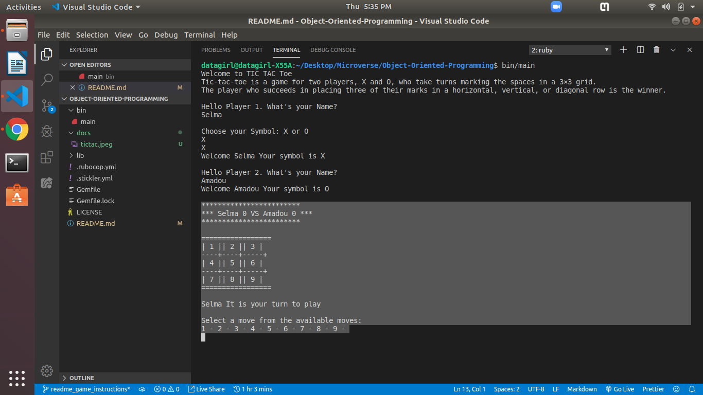
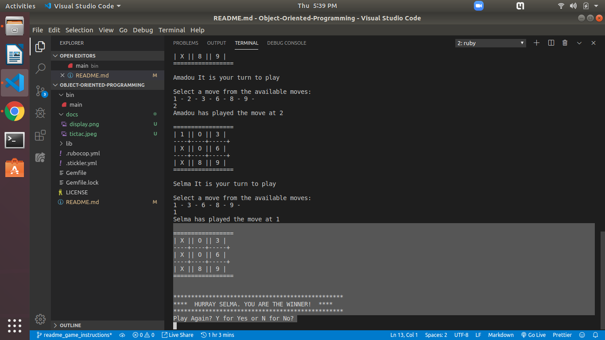

# The TIC TAC Toe Game (Object Oriented Programming) 

<!-- PROJECT LOGO -->
 

    
    

# What is Tic Tac Toe
  Tic-tac-toe is a game for two players, X and O, who take turns marking the spaces in a 3×3 grid.
  The player who succeeds in placing three of their marks in a horizontal, vertical, or diagonal row is the winner.

# Getting Started
1. First off, clone the game:

   git clone https://github.com/Datagirlcmr/Object-Oriented-Programming

2. Open the terminal from where the folder resides / type in the terminal, the following:

   cd Object-Oriented-Programming
   
3. Inside the bin/main.rb file, you'll find the Game class, which handles user interactions; 

  Inside lib/board.rb, player.rb you'll find Tic Tac Toe Logic classes which implements all logic of the game.

4. To run the game type:

   bin/main

On your command prompt, you'll initialize the game.

# Game Rules
1. When the game starts, two players are prompted to provide their names. 
  

    
    

  
2. The first player is further prompted to choose his/her preferred symbol of play; X's or O's 
    By default, the second player gets the other symbol not chosen by the first player
  
3. The board is then displayed as shown below

   

    
    

    
4. The first player chooses between positions [1, 2, 3, 4, 5, 6 ,7 ,8 ,9]
   

    
    

    
5. The second player also chooses any position not chosen by the first player. If he choses an     already chosen position, he will be prompted to choose again, as it is an invalid move
   
6. The first player to get his symbols aligned in a horizontal, vertical or diagonal row wins       the game

7. A draw occurs when all the positions on the board have been filled up, yet no player has       been able to win.
   
8. The Game ends when there is a win or a draw
   

    
    

9. You can always choose to play again or quit the game.
   
  
# Authors

* [Selma Ndi](https://github.com/Datagirlcmr)
* [Amadou Ibrahim](https://github.com/genzaraki)

<!--# License

<!--This project is licensed under the MIT License - see the [LICENSE.md](LICENSE.md) file for details 

<!-- ACKNOWLEDGEMENTS -->
## Acknowledgements
* [Microverse](https://www.microverse.org/)
* [The Odin Project](https://www.theodinproject.com/)
* [Readme header](https://github.com/collinsugwu/Microverse201-Enumerable-Methods)

